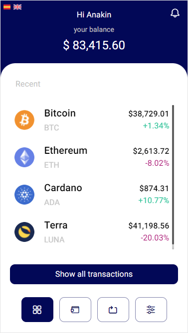

# Kelisto Challenge

Kelisto Challenge is a React Web App.

This project was bootstrapped with [Create React App](https://github.com/facebook/create-react-app).



## Objetive

The main idea of this project is to create a structure for a large future application;  clean, modular and extensible.

## Installation and Setup Instructions

Clone down this repository. You will need `node` and `npm` installed globally on your machine.

Installation:

```bash
npm install
```

To Start Server:

```bash
npm start
```

To Visit App:

```bash
localhost:3000/
```

## Used Libraries

- [Material-UI](https://mui.com/)

- [axios](https://www.npmjs.com/package/axios)

- [react-i18next](https://react.i18next.com/)

- [react-toastify](https://www.npmjs.com/package/react-toastify)

- [prop-types](https://www.npmjs.com/package/prop-types)

- [redux-thunk](https://github.com/reduxjs/redux-thunk)

- [react-redux](https://react-redux.js.org/)

- [styled-components](https://styled-components.com/)

- [eslint](https://eslint.org/)

- [prettier](https://prettier.io/)

### License

kelisto-challenge is [MIT licensed](./LICENSE).
